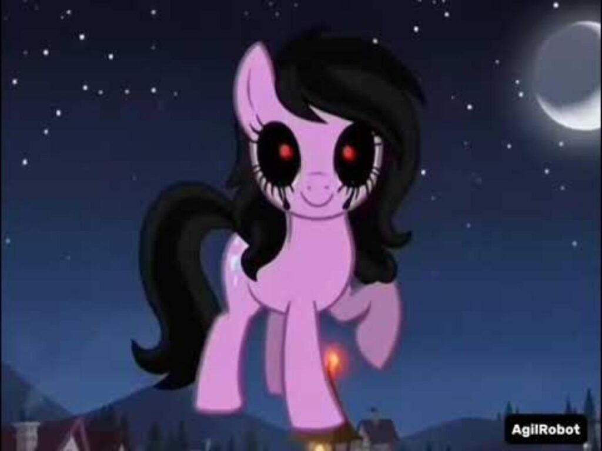

Disclaimer:
I just made a pony character in the Pony Town game, by making an AgilRobot character made by Agilrobot.

# 🦄 Pony Town Character: AgilRobot

## 📜 Terms of Use (License Extension)
The "AgilRobot" character is shared under the following conditions:
1. **Distribution:** You are allowed to share and distribute this character on any platform.
2. **No Derivatives:** Strictly prohibited to modify (edit) the design, colors, or assets of this character without prior permission.
3. **Authenticity:** The character must be used in its original form, strictly following the Hex Code data provided here.

---
## 🎨 Technical Specifications (Hex Codes)

| Part | Code Color | Preview |
| :--- | :--- | :--- |
| **BaseColor** | `#d18fe0` | [View BaseColor](Screenshot_2026-01-07_140038-1.jpg) |
| **Mane** | `#333333` | [View Mane](Screenshot_2026-01-07_140154-1.jpg) |
| **Eye Color** | `#ff0000` | [View Eye Color](Screenshot_2026-01-07_140222-1.jpg) |
| **Eye Whites** | `#000000` | [View Eye Whites](Screenshot_2026-01-07_140222-2.jpg) |
| **Tail** | `#000000` | [View Tail](Screenshot_2026-01-07_164344-1.jpg) |
| **Back Mane** | `#000000` | [View Back Mane](Screenshot_2026-01-07_164354-1.jpg) |
| **Markings** | `#000000` | [View Markings](Screenshot_2026-01-07_165926-1.jpg) |

AgilRobot Image:

